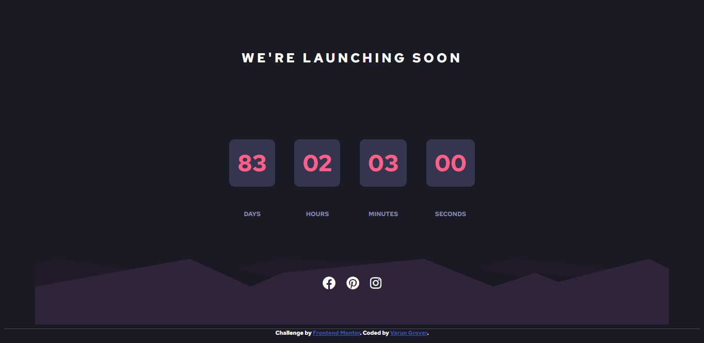

# Frontend Mentor - Launch countdown timer solution

This is a solution to the [Launch countdown timer challenge on Frontend Mentor](https://www.frontendmentor.io/challenges/launch-countdown-timer-N0XkGfyz-). Frontend Mentor challenges help you improve your coding skills by building realistic projects. 

## Table of contents

- [Overview](#overview)
  - [The challenge](#the-challenge)
  - [Screenshot](#screenshot)
  - [Links](#links)
  - [Built with](#built-with)
  - [Author](#author)

## Overview

### The challenge

Users should be able to:

- See hover states for all interactive elements on the page
- See a live countdown timer that ticks down every second

### Screenshot

### Links

- Solution URL: [https://www.frontendmentor.io/solutions/launch-countdown-timer-F0vsLacWQ](https://www.frontendmentor.io/solutions/launch-countdown-timer-F0vsLacWQ)
- Code : [https://github.com/thevarungrovers/launch-countdown-timer-frontend-mentor]()https://github.com/thevarungrovers/launch-countdown-timer-frontend-mentor
- Live Site URL: [https://elegant-shirley-71929e.netlify.app/](https://elegant-shirley-71929e.netlify.app/)

### Built with

- Semantic HTML5 markup
- CSS custom properties
- Mobile-first workflow

### Author

- Frontend Mentor - [@thevarungrovers](https://www.frontendmentor.io/profile/thevarungrovers)
- GitHub - [@thevarungrovers](https://www.github.com/thevarungrovers)
